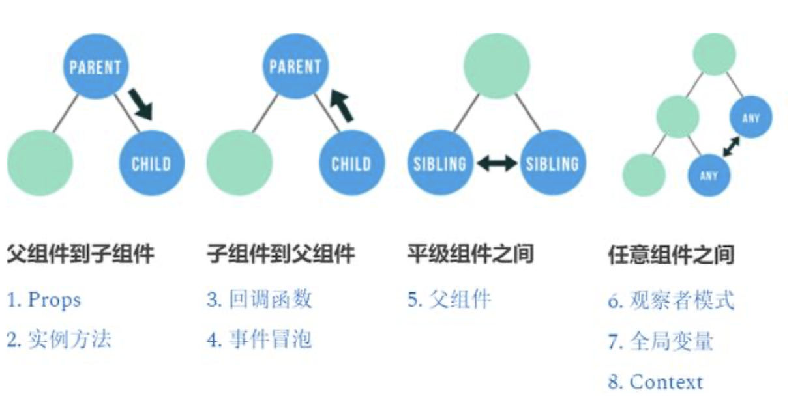
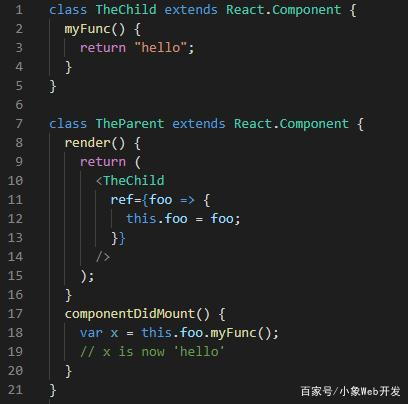

# 组件间通信

## 种类

## 1.props

Props 是目前为止最常用的方式，用于在组件之间传递信息。用 props 可以把数据从父组件传递到它的子组件中。

Props 是 React 的核心功能，也是 React 的基础知识。如果还不熟悉的话，需要访问官网阅读相关文档。

## 2.实例方法

在父组件中可以用 refs 引用子组件，之后就可以调用子组件的实例方法了。这是另一种从父组件访问子组件的方式。

## 3.回调函数

方法 1 和 2 介绍了如何把数据从父组件传给子组件，如果反过来传值如何做呢？如何把数据从子组件传给它的父组件？

最简单的方式是在父组件中传递一个函数给子组件，子组件可以使用这个函数来把数据传给它的父组件。

在父组件中可以这样把一个函数作为属性传给子组件，例如：

然后子组件可以这样调用这个函数：

最后不要忘记在子组件的 propTypes 中声明这个函数：

## 4.事件冒泡

事件冒泡并非 React 的概念，而是浏览器中 DOM 的事件机制。和回调函数类似，它也可以把数据从子组件发送到父组件。

当你想在父组件中捕获来自子组件中的 DOM 事件时，可以采用此方法。

在上述代码中，点击子组件中的 div 元素之后，在浏览器的控制台可以看到输出了这个 div 元素。这是因为我们在父组件中定义的事件监听器成功监听到了来自子组件冒泡上来的 click 事件。

## 5.父组件

如果两个需要通讯的组件，它们拥有共同的父级组件，我们可以使用上述的策略组合，只是需要使用父级组件作为沟通的媒介，把数据作为父组件的 state 和方法来定义。

## 6.观察者模式

观察者模式是一种软件设计模式，一个对象可以在需要时发送数据到多个其他对象。

这种方式适用于所有组件，不需要时父子组件或者平级组件。

一般的做法是在 componentDidMount() 里订阅事件，在 componentWillUnmount() 里取消订阅，然后在接收事件时调用 setState() 方法。

网上有许多库实现了观察者模式，例如 PubSubJS，EventEmitter等。

## 7.全局变量

一般来说，使用全局变量不是最佳实践。不过它很实用，可以帮你节省大量时间。如果谨慎使用是完全没问题的。

建议定义全局变量时用 window. 明确定义，以后管理维护时会更加方便。在一个组件的生命周期或者事件监听器里设置 window.x 全局变量，然后在其他组件里就可以用 window.x 读取它了。

## 8.Context

Context 和 props 类似，不过它不是为单个子组件传递数据，它可以为整个子树提供数据。

Context 只可以在树中向下传递数据（父组件到子树）。可以配合回调函数来向上传递数据（子树到父组件）。

典型的可以使用 Context 的场景有在组件树中传递已登录的用户信息，首选语言，或主题。不过需要注意不要滥用它，因为那样会让组件的重用变得更加困难。

更多信息可以访问 React 官方文档。